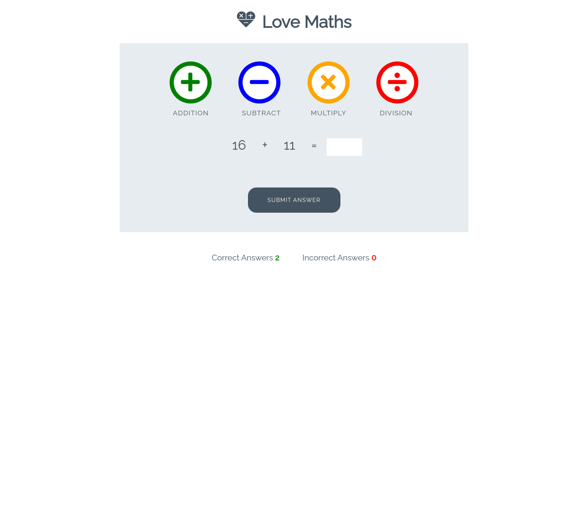

# Love Maths
Fully responsive JavaScript maths game. Object of this excercise is to practice JavaScript by implementing a simple game where the goal is to get the correct solution to a maths question. Game will keep track of right / wrong answers during play.

# Technologies
* JavaScript
* HTML5
* CSS

# Features
* Responsive design
* Win / Loss counter
* Math functions

# Screenshot

# Demo 

You can play with the demo here:

https://azelliott.github.io/love-maths/

# Deployment

To deploy the project locally:

`git clone https://github.com/Azelliott/love-maths`